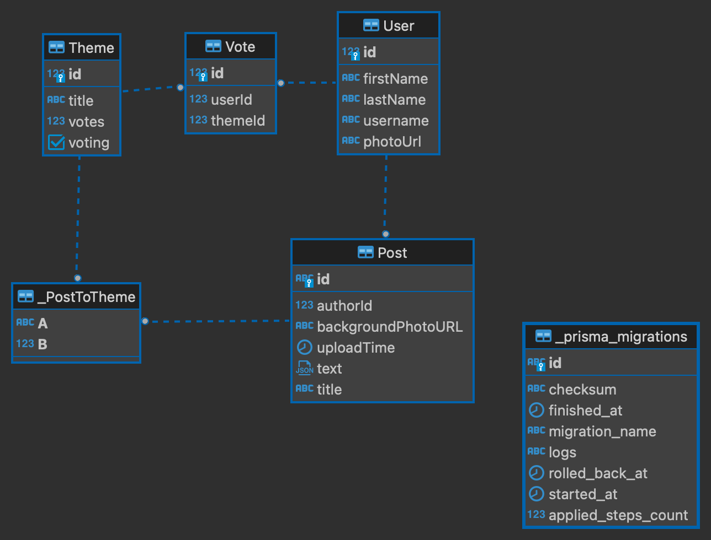

# ideas

## About

This project is about practicing writing. At the begining of each week users are voting for the theme. Top 3 themes are selected. Your goal is to write an article or a story to combine all 3 themes.

## Technical solutions

Text editing is done with `editor.js` library.  
Authentication is done with telegram auth.

## DB confing

User –– user entity  
Post –– user's text  
Vote –– user's vote for the theme  
Theme –– theme for the posts  

